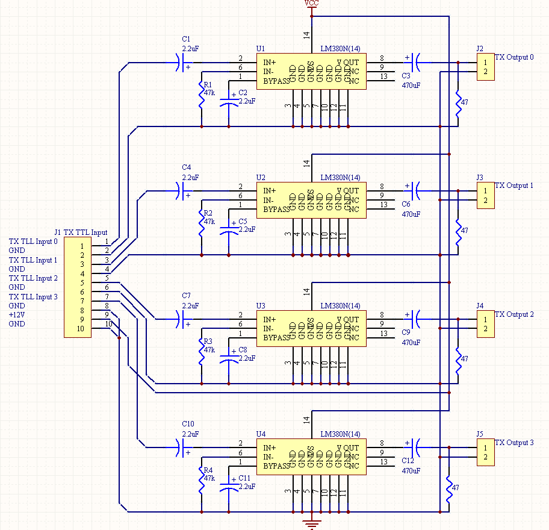

<div class="text-center p-4">
  
  
  
</div>

Hooked was a fishing game that me and my two other classmates in ICS 211 (Java-base class) created. Our fishing game, ‘Hooked!”, pits two players against each other in a year-long fishing competition. Each player will have a chance to fish every month, giving them 12 opportunities each to reel in the biggest catch. Throughout the game, players will have the options to cast out for a fish, read the rules, check their sack, and remove fish from their sack. During the game, players can select from different tools from a net to a fishing pole. The tools are used differently and may affect the outcome of the catch. The winner is determined based on the total length of the three largest fish caught by each player.

For this project, my job was to create a class for all the types of Hawaiian fish, giving them the name, and the minimum and maximum lengths, and implementing interfaces for them to change colors and sex as they grow. During this project, there was a lot of collaboration, such as coming up with different ideas and rules to add to the game. I also finished the project by making sure our checkstyle on JGrasp is on point.  One other thing we did end up implementing was the ability to feed the fish, of course, that takes away your chance to fish for the month, but ultimately feeding the fish will aid the player to receive a bigger fish. 

```

You can learn more at the [UH Micromouse News Announcement](https://manoa.hawaii.edu/news/article.php?aId=2857).
