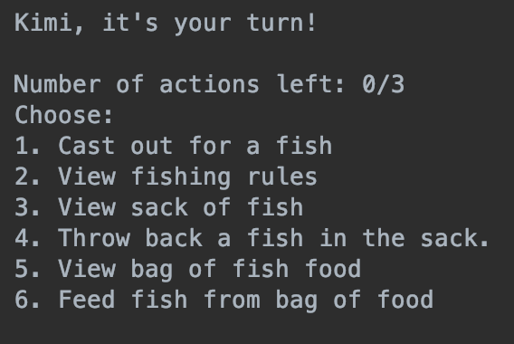

  

"Hooked", is a two-player text-based game that I had the pleasure to build with two of my classmates in ICS 211 (Java class). We used Java to create this fishing game where two players compete against each other to see who ultimately has the biggest catch within the course of three months. Throughout the game, players will have the option to cast out for a fish, read the rules, check their sack, and remove fish from their sack. During the game, players can select from different tools from a net to a fishing pole. The tools are used differently and may affect the outcome of the catch. The winner is determined based on the total length of the three largest fish caught by each player.

For this project, my main responsibility was to develop the classes for the various types of Hawaiian fish we add to the game, and I also implemented interfaces for the fishes so could change colors and sex as they grow. My final job as we finished putting the game together was to make sure our checkstyle was on point. Throughout this project, we incorporated different ideas to create new rules. For instance, we later coded a method that gives the player an option to either fish or feed the fish for the month, which in turn give an advantage to fishing a larger fish the next month.

[View the code](https://github.com/kqimi/Fish-Game).

